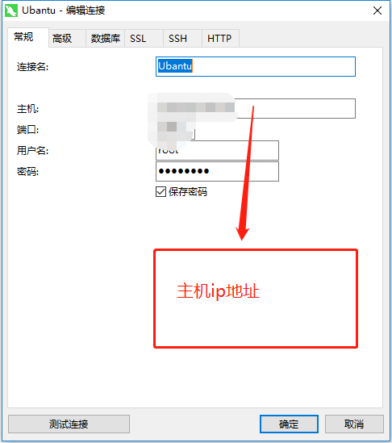

####  Ubantu创建.sh文件的快捷方式，在usr/share/applications/下使用vim编辑 ####
#!/usr/bin/env xdg-open   
[Desktop Entry]     
Version=1.0    
Type=Application    
Name=PyCharm Professional Edition     
Icon=/opt/pycharm-2018.2.1/bin/pycharm.png    
Exec="/opt/pycharm-2018.2.1/bin/pycharm.sh" %f     
Comment=Python IDE for Professional Developers     
Categories=Development;IDE;     
Terminal=false       
StartupWMClass=jetbrains-pycharm     

#### ubantu下搭某个东西 ####
###### 1.安装python-pip ######
   apt-get update   
   apt-get install python-gevent python-pip  
   pip install shadowsocks 
###### 2.新建一个配置文件 ###### 
   vim /etc/ss.json 

// 输入命令后进入编辑页面按i进入insert模式，输入下面的配置信息： 
{ 
    "server":"0.0.0.0",  
    "server_port":8388,   
    "local_port":1080,    
    "password":"barfoo!",    
    "timeout":600,    
    "method":"table"   
}
// server          服务器 IP (IPv4/IPv6)，注意这// 也将是服务端监听的 IP 地址   
// server_port     服务器端口   
// local_port      本地端端口   
// password        用来加密的密码   
// timeout         超时时间（秒）   
// method          加密方法，可选择 "bf-cfb", "aes-256-cfb", "des-cfb"等等。默认是一种不安全的加密，推荐用 "aes-256-cfb"   
###### 3.启动服务 ###### 
   ssserver -c /etc/ss.json -d start 
###### 4.开机启动服务 ###### 
   /usr/local/bin/ssserver -c /etc/ss.json -d start 

#### Ubantu下搭建MySQL服务 ####
###### 1.执行安装命令 ######
    sudo apt-get install mysql-server  
    sudo apt isntall mysql-client    
    sudo apt install libmysqlclient-dev   

###### 2.测试是否安装成功 ######
    sudo netstat -tap | grep mysql  
###### 3.进入MySQL ###### 
    mysql -uroot -p 
###### 4.配置远程可访问 ###### 
    sudo vim /etc/mysql/mysql.conf.d/mysqld.cnf  
    注释掉bind-address = 127.0.0.1  
    保存退出，然后进入mysql服务，执行授权命令： 
    grant all on *.* to root@'%' identified by '你的密码' with grant option; 
    flush privileges; 
 ###### 5.重启MySQL服务 ###### 
    service mysql restart  
    
 **navicat配置：**  
 
    
